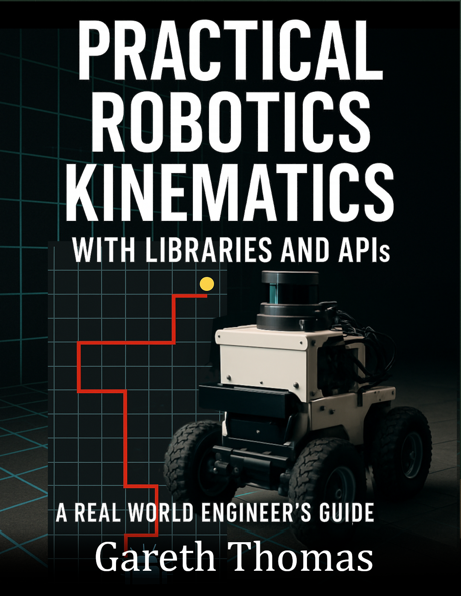

# Practical Robotics Kinematics

### Cover

### Repository Structure
- `covers/`: Book cover images
- `blurbs/`: Promotional blurbs
- `infographics/`: Marketing visuals
- `source_code/`: Code samples
- `manuscript/`: Drafts and format.txt for TOC
- `marketing/`: Ads and press releases
- `additional_resources/`: Extras

View the live site at [burstbookspublishing.github.io/practical-robotics-kinematics](https://burstbookspublishing.github.io/practical-robotics-kinematics/)
---

- Practical Robotics Kinematics with Libraries and APIs
- A Real World Engineer's Guide

---
## Chapter 1. Why Engineers Don't Code Kinematics From Scratch
### Section 1. The Reality Check
- When your manager says "just make the robot move"
- Time-to-market vs reinventing the wheel
- The hidden complexity of "simple" kinematics

### Section 2. Library Landscape and Trade-offs
- Performance benchmarks: Speed vs ease of use
- ROS ecosystem (MoveIt, KDL) - when you're already in ROS
- Standalone libraries (Drake, Pinocchio) - when you need control
- Simulation-first tools (PyBullet, MuJoCo) - prototype before hardware

### Section 3. Choosing Your Stack
- Decision matrix: Project constraints vs library capabilities
- Real-world case studies: What companies actually use
- Migration paths: Starting simple, scaling up

---
## Chapter 2. Getting Your Environment Not to Hate You
### Section 1. The "It Works on My Machine" Problem
- Docker containers for robotics development
- Version hell and how to avoid it
- Cross-platform gotchas (Linux, Windows, Mac)

### Section 2. Installation Battle Plans
- ROS workspace setup that won't break tomorrow
- Python virtual environments for robotics
- Installing Pinocchio, Drake, PyBullet without tears
- Linking C++ libraries with Python bindings

### Section 3. Development Environment Setup
- IDE configuration for robotics workflows
- Debugging tools and visualization setup
- Testing your installation before you need it

---
## Chapter 3. Forward Kinematics: From Joint Angles to "Where Is My Robot?"
### Section 1. Single Manipulator Basics
- Forward kinematics in Pinocchio: Copy-paste examples
- Using Drake's pydrake: When you need more control
- Coordinate frames: The source of 80% of your bugs

### Section 2. Multi-body and Complex Chains
- Computing poses in MoveIt: The ROS way
- Forward kinematics in PyBullet simulation
- Handling branched kinematic trees

### Section 3. Common Gotchas and Red Flags
- When your end-effector is in the wrong universe
- Joint limits and what happens when you ignore them
- Performance: When FK becomes a bottleneck

---
## Chapter 4. Inverse Kinematics: Making Robots Go Where You Want
### Section 1. The Reality of IK Solvers
- Why there's no "perfect" IK solution
- Numerical vs analytic: What the libraries actually do
- Convergence, failure modes, and what to do about them

### Section 2. Practical IK Workflows
- IK in MoveIt: The easy button (when it works)
- Pinocchio IK solvers: More control, more complexity
- Drake IK: Optimization-based approaches
- PyBullet IK: Quick and dirty for simulation

### Section 3. When IK Goes Wrong
- Detecting bad solutions before they break things
- Multiple solutions: Which one to pick?
- Seed points and why they matter more than you think

---
## Chapter 5. Jacobians: The Bridge Between Joint and Task Space
### Section 1. Computing Jacobians Without Crying
- Pinocchio Jacobian API: Fast and reliable
- Drake Jacobian utilities: When you need derivatives too
- Numerical vs analytical: Speed vs accuracy trade-offs

### Section 2. Using Jacobians in Real Applications
- Joint velocity to end-effector velocity mapping
- Force/torque mapping: When robots push back
- Singularity detection: Avoiding the danger zones

### Section 3. Jacobian-Based Control
- Resolved-rate control implementation
- Null-space control: Doing two things at once
- When to use pseudoinverses vs optimization

---
## Chapter 6. Mobile Robot Kinematics: Robots That Drive
### Section 1. Wheeled Mobile Robots
- Differential drive: The bread and butter
- Skid-steer kinematics: When you have tracks
- Using ROS navigation stack: Standing on giants' shoulders

### Section 2. Advanced Mobile Platforms
- Omniwheels and mecanum: Moving sideways
- KDL for mobile base control
- Simulation with MuJoCo: Testing before building

### Section 3. Mobile Manipulation
- Combining mobile base and manipulator kinematics
- Coordinated motion planning
- Real-world constraints: Cables, battery life, and physics

---
## Chapter 7. Simulation Workflows: Test Before You Wreck
### Section 1. Simulation-First Development
- PyBullet joint control: Fast iteration cycles
- MuJoCo kinematics APIs: When accuracy matters
- Gazebo integration: The ROS ecosystem approach

### Section 2. Debugging and Visualization
- Plotting trajectories: Making motion visible
- Real-time visualization tools
- Comparing simulation vs hardware: Reality checks

### Section 3. Simulation to Reality Transfer
- What works in simulation but fails on hardware
- Tuning simulation parameters for reality
- Using simulation data to train real controllers

---
## Chapter 8. Performance and Real-Time Concerns
### Section 1. From Prototype to Production
- When to port Python prototypes to C++
- Profiling performance: Finding the real bottlenecks
- Memory management in real-time systems

### Section 2. Real-Time Kinematics
- Determinism in kinematic computations
- Library usage in hard real-time control loops
- Practical trade-offs: Accuracy vs speed vs reliability

### Section 3. Optimization Strategies
- Caching and precomputation techniques
- Parallel processing for multi-robot systems
- Hardware acceleration: GPUs and specialized processors

---
## Chapter 9. When Things Break (And They Will)
### Section 1. Singularity Hell
- Detecting singularities with API tools
- Avoidance strategies that actually work
- Recovery from singularity-induced failures

### Section 2. IK Solver Failures
- Overconstrained tasks: When you ask for impossible things
- Numerical instability: When math meets reality
- Timeout handling and graceful degradation

### Section 3. Coordinate Frame Debugging
- Transform tree visualization and debugging
- Common frame convention mistakes
- Tools for catching transformation errors

### Section 4. Hardware vs Simulation Differences
- Joint limits in theory vs practice
- Sensor noise and calibration errors
- Dynamic effects that kinematics ignores

---
## Chapter 10. Integration Patterns and Workflows
### Section 1. Multi-Library Integration
- Combining Pinocchio kinematics with MoveIt planning
- Using Drake optimization with ROS ecosystem
- Data format conversions and interface layers

### Section 2. Team Development Workflows
- Version control for robotic systems
- Continuous integration for robotics code
- Code review practices for kinematics implementations

### Section 3. Deployment and Maintenance
- Configuration management across environments
- Monitoring and logging kinematic computations
- Update strategies for production systems

---
## Chapter 11. Complete Case Studies
### Section 1. Industrial Manipulator Control
- Requirements analysis and library selection
- MoveIt-based implementation walkthrough
- Performance optimization and deployment lessons

### Section 2. Autonomous Mobile Robot Navigation
- System architecture and ROS integration
- Real-time path following implementation
- Field testing and iteration cycles

### Section 3. Research to Product Pipeline
- Starting with PyBullet simulation
- Prototyping with Pinocchio
- Production deployment with optimized C++

### Section 4. Multi-Robot Coordination
- Distributed kinematics computation
- Conflict resolution and task allocation
- Scaling challenges and solutions
---
